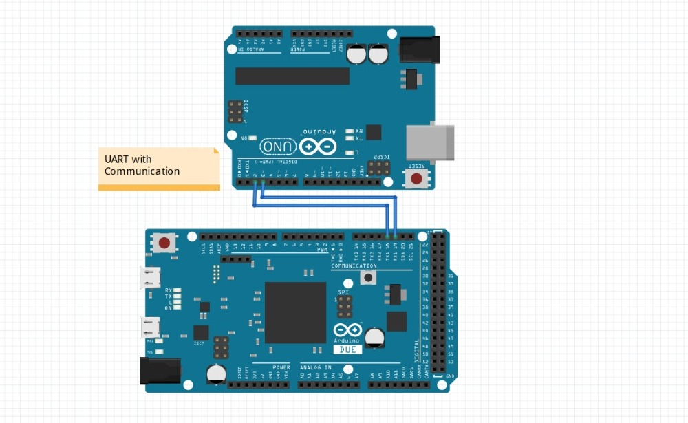
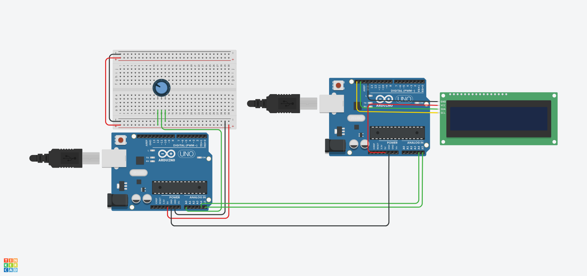

# hardware communication for microcontroller

### baseUART

we maked at uart communication for two arduino and others
we use a struct, pointer and bytewise operating

### baseI2C 

we use i2c communication for two arduino and others
and a arduino master and the other arduino slave, come values from master , slave is showing display comming value 
we use a bytewise and byteshift operating

