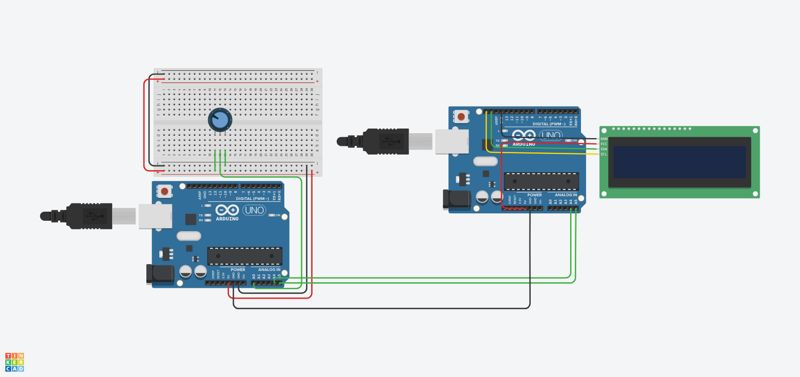
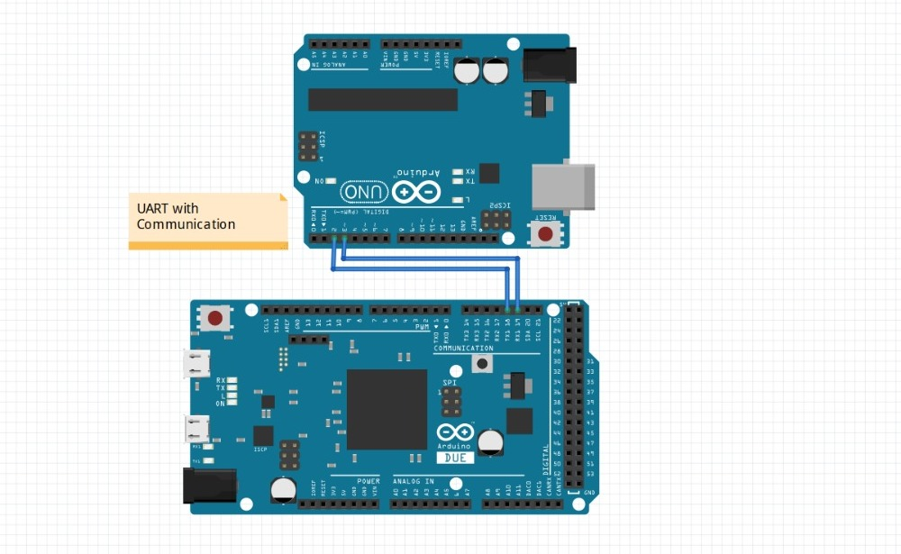

# Hardware Communication for Microcontrollers

This repository contains comprehensive examples of different communication protocols for Arduino microcontrollers. The project demonstrates three main communication methods: I2C, UART, and TCP/IP, each implemented with detailed code examples and practical applications.

## Project Overview

This project provides working implementations of hardware communication protocols commonly used in embedded systems and IoT applications. Each communication method is organized in separate directories with complete, tested code examples.

## Communication Protocols

### 1. I2C Communication (baseI2C)

Inter-Integrated Circuit (I2C) communication between Arduino boards using master-slave architecture.

**Features:**
- Master-slave communication setup
- Two implementation approaches: bytewise and byteshift
- Real-time data transmission from potentiometer
- LCD display integration for visual feedback
- Potentiometer value scaling and transmission

**Hardware Setup:**
- Master: Arduino Uno with potentiometer on analog pin A0
- Slave: Arduino Uno with I2C LCD display
- I2C connections: SDA (A4), SCL (A5)

**Implementations:**
- **Bytewise**: Direct byte transmission with bit shifting (2^10 to 2^8 conversion)
- **Byteshift**: Union-based byte manipulation for multi-byte data transmission



### 2. UART Communication (baseUART)

Universal Asynchronous Receiver-Transmitter communication between Arduino Mega and Arduino Uno.

**Features:**
- Structured data packet transmission
- Checksum validation for data integrity
- Command-based control system
- Software serial communication for Arduino Uno
- Digital pin control based on received commands

**Hardware Setup:**
- Master: Arduino Mega (Hardware Serial1)
- Slave: Arduino Uno (SoftwareSerial pins 2,3)
- Serial communication at 9600 baud rate

**Data Structure:**
```cpp
typedef struct {
    uint16_t start;      // Start frame (0xABCD)
    int16_t id;          // Command ID
    int16_t data;        // Primary data
    int16_t data1-7;     // Additional data fields
    uint16_t checksum;   // Validation checksum
} SerialCommand;
```



### 3. TCP/IP Communication (baseTCP_IP)

Ethernet-based TCP/IP communication for Arduino Mega with network connectivity.

**Features:**
- Ethernet shield integration
- TCP server/client communication
- Network-based data transmission
- Integration with UART for multi-protocol communication
- C++ client applications for testing

**Hardware Setup:**
- Arduino Mega with Ethernet shield
- Network configuration: IP 192.168.31.177
- Telnet communication on port 23
- MAC address: DE:AD:BE:EF:FE:ED

**Network Components:**
- TCP server implementation on Arduino
- C++ client applications for testing
- Data packet transmission over Ethernet
- Serial communication bridge functionality

## Technical Details

### Data Transmission Methods

1. **I2C Bytewise Method:**
   - Potentiometer reading (0-1023) converted to 8-bit (0-255)
   - Right-shift operation: `pot >> 2`
   - Direct byte transmission over I2C bus

2. **I2C Byteshift Method:**
   - Union data structure for byte manipulation
   - 16-bit integer transmission as two separate bytes
   - Byte reconstruction: `a = x + y*256`

3. **UART Protocol:**
   - Fixed packet structure with start frame
   - Multi-field data transmission
   - Checksum validation for reliability
   - Command-based device control

4. **TCP/IP Protocol:**
   - Standard Ethernet communication
   - Socket-based data transmission
   - Network bridge for serial communication
   - Remote monitoring and control

### Code Structure

Each communication method includes:
- **Master/Client code**: Initiates communication and sends data
- **Slave/Server code**: Receives data and performs actions
- **Data structures**: Defined protocols for reliable communication
- **Error handling**: Validation and debugging features

### Setup and Usage

1. **Hardware Connections**: Follow the wiring diagrams for each protocol
2. **Library Dependencies**: Install required Arduino libraries
3. **Code Upload**: Flash appropriate code to master and slave devices
4. **Testing**: Use serial monitors and display outputs for verification

### Applications

- **IoT Sensor Networks**: Multi-protocol data collection
- **Industrial Automation**: Reliable device communication
- **Remote Monitoring**: Network-based system control
- **Educational Projects**: Learning embedded communication protocols

This project serves as a comprehensive reference for implementing various communication protocols in Arduino-based projects, providing both theoretical understanding and practical implementation examples.
