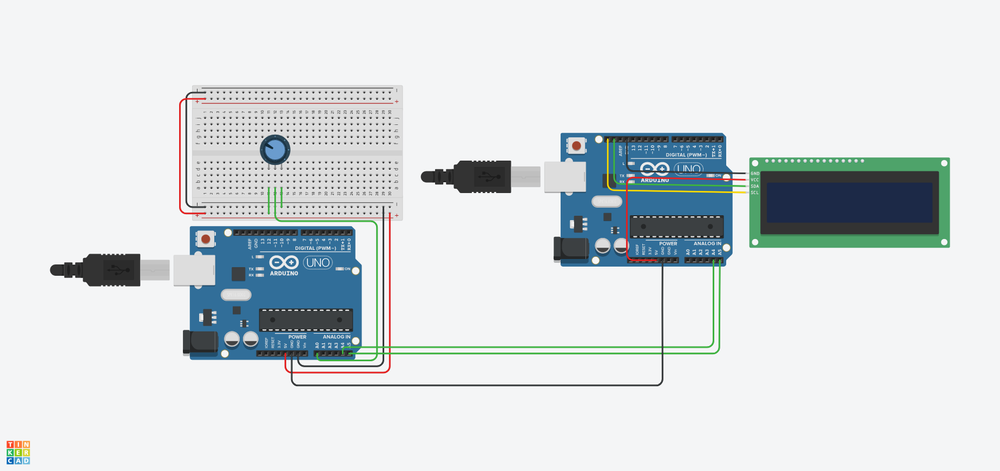

# baseI2C

arduino uno "master" and arduino uno slave 

two different byte operating 
communication image 

### byteshift link tinkercad
[first_example](https://www.tinkercad.com/things/eE9b4X5jmpW-copy-of-i2c-com-with-wireh/editel?sharecode=XLDyg7p9E6Mbm2572xAJjLvie2I9KFtmwcOHa5AqQSc)

### bytewise link tinkercad
[second_example](https://www.tinkercad.com/things/cnZYMkmAhdb-copy-of-i2c-com-with-wireh/editel?sharecode=hEAVQgVywABOqQ5WvQSRtm-AC5PjpibXAh19wcuV0Ys)

